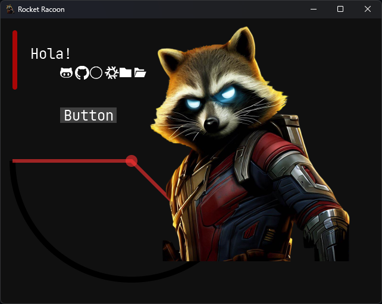

# cairo-sdl2-software-rendering
A test project to check the performance and memory usage of software rendering in SDL2 with help of Cairo.



### Building
- Windows:
  ```powershell
  .\scripts\windows\gen_makefiles.bat
  .\scripts\windows\build_and_run_release.bat
  ```
- Linux:
  🚧 WIP
- macOS:
  🚧 WIP
